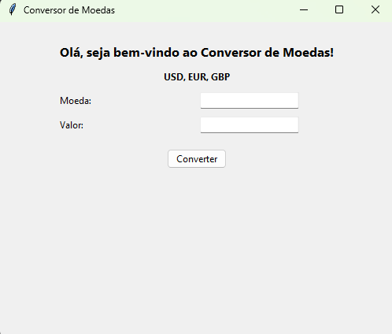

# 🚀 Conversor de Moedas | Currency Converter

Aplicação desktop para conversão de moedas em tempo real utilizando API externa.

---

## 📌 🇧🇷 Descrição

Aplicação desktop desenvolvida em **Python** que realiza a conversão de moedas para **Real (BRL)** utilizando taxas de câmbio em tempo real através da API **Frankfurter**.

O projeto tem como objetivo reforçar conceitos de:

- Consumo de API (requisições HTTP)
- Manipulação de JSON
- Lógica de programação
- Interface gráfica com Tkinter

---

## 📌 🇺🇸 Description

Desktop application built with **Python** that converts foreign currencies to **Brazilian Real (BRL)** using real-time exchange rates provided by the **Frankfurter API**.

This project focuses on:

- API consumption (HTTP requests)
- JSON handling
- Programming logic
- GUI development with Tkinter

---

## 🛠️ Ferramentas/Tecnologias Utilizadas | Tools/Technologies Used

- 🐍 Python 3
- 🖼 Tkinter (GUI)
- 🌐 Frankfurter API
- 💻 VS Code

---

## 📷 Preview

  

